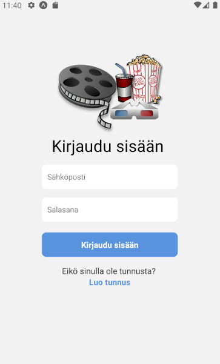

# MobiiliSovellus

Elokuva aiheinen mobiilisovellus, joka on luotu keväällä 2021 Haaga-Helian Mobiiliohjelmointi kurssin lopputyöksi.

Sovellus käyttää kirjautumiseen ja tietojen tallentamiseen [Firebasen](https://firebase.google.com/) Firestorea ja antaa käyttäjille
mahdollisuuden luoda oma elokuvalistansa [API](https://www.omdbapi.com/) hakua käyttäen. Lisättyään elokuvia
listallensa voi elokuvat merkitä katsotuiksi ja ne voidaan arvioida.

# Kirjautuminen ja tunnuksen luonti

 

# Elokuvien hakeminen

 

# Oma Elokuva lista

 

